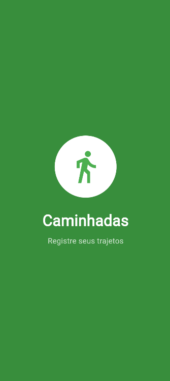
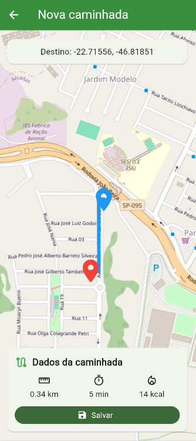
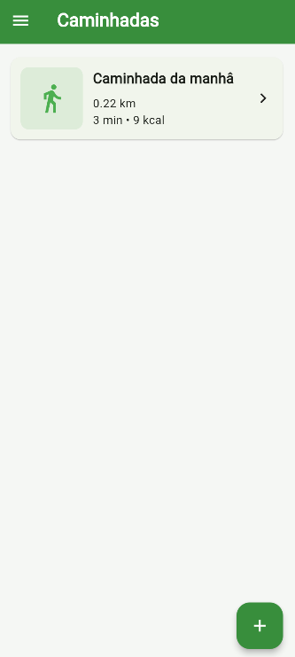

# Caminhadas

Aplicativo desenvolvido em Flutter para registrar e acompanhar caminhadas.

O aplicativo permite cadastrar caminhadas, selecionar um destino no mapa, visualizar a rota, calcular a distância, estimar o tempo de caminhada e as calorias gastas, além de armazenar os registros localmente.

## Tecnologias utilizadas

- Flutter
- Dart
- Flutter Map
- OpenStreetMap
- OSRM
- Shared Preferences
- Image Picker

## Funcionalidades

- Splash Screen com animação de entrada e saída
- Tela inicial com caminhadas cadastradas
- Cadastro de novas caminhadas
- Seleção de destino pelo mapa
- Visualização da rota da caminhada
- Cálculo da distância
- Estimativa de calorias
- Estimativa do tempo de caminhada
- Armazenamento local das caminhadas
- Visualização dos detalhes de uma caminhada
- Adição de foto à caminhada
- Menu lateral
- Alteração entre tema claro e escuro
- Opção para sair do aplicativo

## Telas do aplicativo

## Telas do aplicativo

### Splash Screen

Tela inicial do aplicativo, apresentada ao abrir o sistema, com animação de entrada e o nome do aplicativo.



### Nova caminhada

Tela utilizada para registrar uma nova caminhada, permitindo selecionar o destino no mapa e visualizar a rota calculada pelo aplicativo.



### Tela inicial

Tela principal do aplicativo, onde são apresentadas as caminhadas cadastradas e suas principais informações.



---

## Como executar o projeto

### 1. Clonar o repositório

```bash
git clone URL_DO_SEU_REPOSITORIO
```

### 2. Entrar na pasta do projeto

```bash
cd caminhadas_app
```

### 3. Instalar as dependências

```bash
flutter pub get
```

### 4. Executar o aplicativo

```bash
flutter run
```

Para executar no navegador:

```bash
flutter run -d chrome
```

## Estrutura do projeto

```text
lib/
├── main.dart
├── models/
│   └── caminhada.dart
├── screens/
│   ├── splash_screen.dart
│   ├── home_screen.dart
│   ├── nova_caminhada_screen.dart
│   └── detalhes_caminhada_screen.dart
├── services/
│   ├── rota_service.dart
│   └── caminhada_storage_service.dart
├── utils/
│   └── calculadora_caminhada.dart
└── widgets/
    ├── menu_lateral.dart
    └── caminhada_card.dart
```

## Armazenamento

As caminhadas cadastradas são armazenadas localmente utilizando o `Shared Preferences`, permitindo que os registros permaneçam salvos mesmo depois de fechar o aplicativo.

## Mapas e rotas

O aplicativo utiliza o **Flutter Map** para exibição do mapa e o **OpenStreetMap** como fonte dos dados cartográficos.

As rotas são obtidas por meio do serviço de roteamento utilizado pelo aplicativo.

## APK

O arquivo APK do aplicativo está disponível na pasta do projeto.

## Desenvolvido por

**Clara Andrzejewsky Antonacci**

Projeto desenvolvido para a atividade de Flutter.
